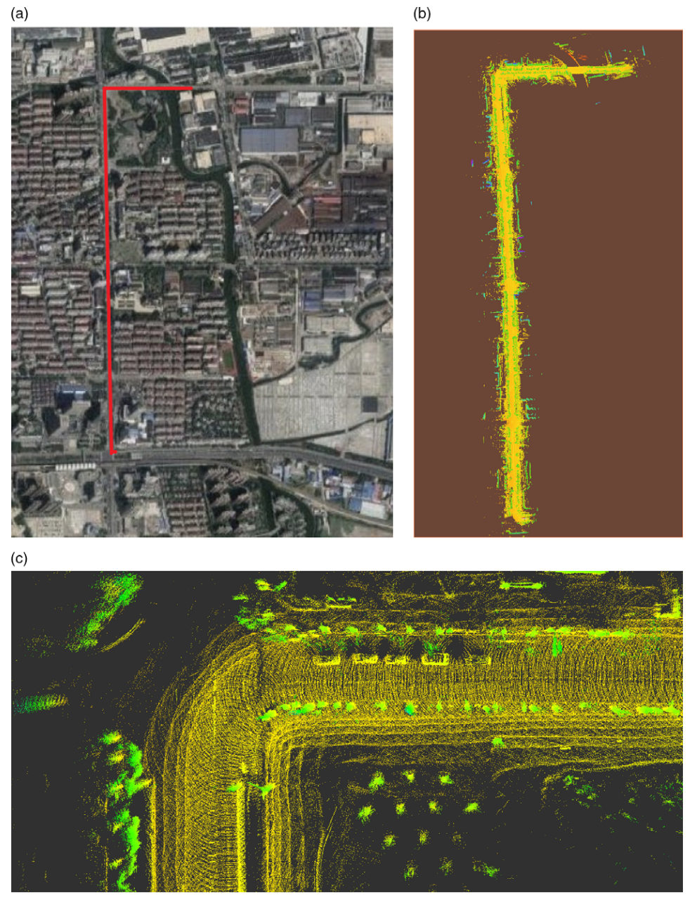

刘奇，男，工学博士，东北大学机器人科学与工程学院特聘副研究员（[学校个人主页](http://faculty.neu.edu.cn/liuqi/zh_CN/index.htm))。2024年获哈尔滨工业大学（深圳）控制科学与工程专业博士学位（导师：[李衍杰教授](https://faculty.hitsz.edu.cn/liyanjie)，[楼云江教授](https://faculty.hitsz.edu.cn/louyunjiang))，研究方向为深度强化学习算法、具身智能和大模型等。在国内外著名学术期刊和会议上发表论文30余篇，其中第一或通讯作者论文10余篇。主持国家自然科学基金青年项目等纵向和横向项目3项，作为骨干研究人员参与国家自然科学联合/面上基金等项目多项。先后在四家具身智能和大模型公司从事研究工作，中国自动化学会/人工智能学会/指挥与控制学会会员，受邀担任多个国际期刊和会议 (IEEE TNNLS, TITS, TCYB, SMC, RAL, TIV, INS, KBS, ICRA, IROS等) 审稿人。指导学生获奖国家或省部级及以上科技竞赛/创新创业大赛3项。
<!--2019年获哈尔滨工业大学控制科学与工程专业硕士学位（导师：[遆晓光教授](https://homepage.hit.edu.cn/dixiaoguang)，[马杰教授](https://homepage.hit.edu.cn/majie?lang=zh)）。-->

Qi Liu is currently an Associate Researcher at the Faculty of Robot Science and Engineering, Northeastern University, China ([faculty profile](http://faculty.neu.edu.cn/liuqi/zh_CN/index.htm)). He received the Ph.D. degree in Control Science and Engineering from Harbin Institute of Technology (Shenzhen) in 2024 (advised by [Prof. Yanjie Li](https://faculty.hitsz.edu.cn/liyanjie) and [Prof. Yunjiang Lou](https://faculty.hitsz.edu.cn/louyunjiang)). His research focuses on deep reinforcement learning algorithms, embodied intelligence, and large language models (LLMs). He has published over 20 papers in renowned international journals and conferences, including over 10 papers as the first or corresponding author. He has presided over three government-funded and industry-sponsored projects, including the Young Scientists Fund of the National Natural Science Foundation of China (NSFC), and has participated as a core researcher in multiple initiatives such as the NSFC Joint Funds and General Fund. He has conducted research at four companies specializing in embodied intelligence and LLMs. He is a member of the Chinese Association of Automation (CAA), the Chinese Association for Artificial Intelligence (CAAI), and the Chinese Institute of Command and Control (CICC). Additionally, he has been invited to serve as a reviewer for several prestigious international journals and conferences (e.g., IEEE TNNLS, TITS, TCYB, SMC, RAL, TIV, INS, KBS, ICRA, IROS). Under his guidance, students have won three awards in national or provincial/ministerial-level sci-tech and innovation entrepreneurship competitions.
<!--and the M.S. degree in Control Science and Engineering from Harbin Institute of Technology in 2019 (advised by [Prof. Xiaoguang Di](https://homepage.hit.edu.cn/dixiaoguang) and [Prof. Jie Ma](https://homepage.hit.edu.cn/majie?lang=zh))-->

## 研究方向
主要研究方向为深度强化学习算法和具身智能：
- **深度强化学习算法**：如价值函数估计、智能体探索、安全强化学习等
- **多智能体深度强化学习算法**：如多智能体协作、信用分配等
- **大语言模型对齐**：如安全价值对齐、人类反馈强化学习等
- **具身智能**：基于学习（深度强化学习、模仿学习和大模型等）的各类智能机器人控制、决策和协作，如：四足机械狗的步态和技能学习、机械臂和多指灵巧手的操作、双足人形机器人全身控制、轮式机器人和无人驾驶导航。

**欢迎对上述方向感兴趣的学生（本硕博）和工业界朋友联系，进行科研（可远程）和项目合作。**           
**也欢迎对深度强化学习在其他领域的应用（如：智能电网、推荐系统、自动股票交易等）感兴趣的学生和工业界朋友联系，本人也做过相关的研究。**               
**邮箱：liuqi@mail.neu.edu.cn，手机和微信号：13713517967。**

## Research Interests
His primary research interests include deep reinforcement learning algorithms and embodied intelligence:
- **Deep Reinforcement Learning Algorithms**: Value function estimation, agent exploration, safe reinforcement learning, etc.
- **Multi-Agent Deep Reinforcement Learning Algorithms**: Multi-agent coperation, credit assignment, etc.
- **Large Language Model Alignment**: Safe value alignment, reinforcement learning from human feedback, etc.
- **Embodied Intelligence**: Learning-based (deep reinforcement learning, imitation learning, and large language models) control, decision-making, and collaboration for various intelligent robots, such as gait and skill learning for quadruped robots, manipulation with robotic arms and multi-fingered dexterous hands, whole-body control of bipedal humanoid robots, and navigation for wheeled robots and autonomous vehicles.

**Students (undergraduate, master, and PhD) and industry professionals who are interested in the aforementioned research directions are warmly welcome to reach out for potential research collaborations (remote collaboration is available).**  
**Additionally, students and industry professionals interested in the application of deep reinforcement learning in other fields (e.g., smart grids, recommendation systems, automated stock trading, etc.) are also encouraged to contact me, as I have conducted related research in these areas.**       
**Email：liuqi@mail.neu.edu.cn**

## 研究经历
**[星动纪元](https://www.robotera.com/)** &emsp; 北京 &nbsp; 08/2024 - 11/2024    
研究方向：具身智能研究实习算法工程师，基于深度强化学习的机械臂和5指灵巧手控制。 \
Mentor：[陈建宇](https://scholar.google.com/citations?user=rc9jIf0AAAAJ&hl=en)，清华大学交叉信息研究院助理教授。   

**[智谱AI](https://www.zhipuai.cn/)** &emsp; 北京 &nbsp; 03/2024 - 06/2024     
研究方向：大语言模型(Large Language Model, LLM) 研究实习算法工程师，研究基于大模型的代码生成。 \
Mentor：[牛艺霖](https://scholar.google.com/citations?user=O52EyKsAAAAJ&hl=zh-CN)，智谱AI大模型对齐(RLHF)组负责人。  

**[粤港澳大湾区数字经济研究院(IDEA)](https://www.idea.edu.cn/)** &emsp; 深圳 &nbsp; 08/2023 - 02/2024     
研究方向：LLM研究实习算法工程师，研究LLM对齐(Reinforcement Learning from Human Feedback, RLHF)及其改进。 \
Mentor：[张家兴](https://scholar.google.com/citations?user=ozXuhOUAAAAJ&hl=en)，IDEA研究院讲席科学家。  

**[地平线机器人](https://www.horizon.auto/)** &emsp; 上海自动驾驶研发中心 &nbsp; 07/2018 - 12/2018             
研究方向：无人驾驶研究实习算法工程师，研究室外无人车定位与建图算法(SLAM)。 \
Mentor：徐斌峰，地平线机器人算法工程师。

## Research Experience
**[ROBOTERA, Inc.](https://www.robotera.com/en/)** &emsp; Beijing &nbsp; 08/2024 - 11/2024    
Topic: Embodied Intelligence Research Intern @Algorithm Team, Research on the control of robot arms and dexterous hands based on deep reinforcement learning. \
Mentor: [Jianyu Chen](https://scholar.google.com/citations?user=rc9jIf0AAAAJ&hl=en), Assistant Professor at Institute for Interdisciplinary Information Sciences, Tsinghua University.    

**[Zhipu AI, Inc.](https://www.zhipuai.cn/en/)** &emsp; Beijing &nbsp; 03/2024 - 06/2024    
Topic: LLM Research Intern @LLM RLHF Team, Research on LLM Code Generation and its improvement. \
Mentor: [Yilin Niu](https://scholar.google.com/citations?user=O52EyKsAAAAJ&hl=zh-CN), Leader of LLM RLHF Team at Zhipu AI.      

**[International Digital Economy Academy (IDEA)](https://www.idea.edu.cn/)** &emsp; Shenzhen &nbsp; 08/2023 - 02/2024       
Topic: LLM Research Intern @LLM RLHF Team, Research on LLM Alignment (RLHF) and its improvement. \
Mentor: [Jiaxing Zhang](https://scholar.google.com/citations?user=ozXuhOUAAAAJ&hl=en), Chair Professor at IDEA.           

**[Horizon Robotics, Inc.](https://en.horizon.auto/)** &emsp; Shanghai Research Center &nbsp; 07/2018 - 12/2018               
Topic: Autonomous Driving @SLAM Team, Research on the localization and mapping of autonomous vehicles. \
Mentor: Binfeng Xu, Algorithm Engineer at Horizon Robotics, Inc.

## 科研论文（部分）（#共同一作, *通讯作者） 
- **Qi Liu#**, Jingxiang Guo#, Sixi Lin, Shuaikang Ma, Jinxuan Zhu, Yanjie Li. MASQ: Multi-Agent Reinforcement Learning for Single Quadruped Robot Locomotion. International Conference on Machine Learning (ICML) Workshop, 2025. (CSRankings)
- **Qi Liu**, Yanjie Li, Xiongtao Shi, Ke Lin, Yuecheng Liu, Yunjiang Lou. Distributional Policy Gradient With Distributional Value Function. IEEE Transactions on Neural Networks and Learning Systems, 2024. (JCR 1区，中科院大类1区，IF: 10.4，TOP期刊)
- **Qi Liu**, Yanjie Li, Yuecheng Liu，Ke Lin，Jianqi Gao, Yunjiang Lou. Data Efficient Deep Reinforcement Learning With Action-Ranked Temporal Difference Learning, IEEE Transactions on Emerging Topics in Computational Intelligence, 2024. (JCR 1区，中科院大类2区，IF: 6.5)
- **Qi Liu**, Yanjie Li, Shiyu Chen, Ke Lin, Xiongtao Shi, Yunjiang Lou. Distributional Reinforcement Learning With Epistemic and Aleatoric Uncertainty Estimation. Information Sciences, 2023. (JCR 1区，中科院大类1区，IF: 8.1，TOP期刊)
- Zheng Zhang#, **Qi Liu#**, Yanjie Li, Ke Lin, Linyu Li. Safe Reinforcement Learning in Autonomous Driving With Epistemic Uncertainty Estimation. IEEE Transactions on Intelligent Transportation Systems, 2024. (JCR 1区，中科院大类1区，IF: 8.5，TOP期刊)
- Pengbin Chen#, **Qi Liu#**, Yanjie Li, Shuaikang Ma. An Environmental-Complexity-Based Navigation Method Based on Hierarchical Deep Reinforcement Learning. 2024 IEEE International Conference on Robotics and Automation (ICRA), 2024. (机器人顶会，CSRankings)
- Jianqi Gao, Xizheng Pang, **Qi Liu***, Yanjie Li*. Hierarchical Reinforcement Learning for Safe Mapless Navigation with Congestion Estimation. 2025 IEEE International Conference on Robotics and Automation (ICRA), 2025. (机器人顶会，CSRankings)
- **Qi Liu**, Xiaoguang Di, Binfeng Xu. Autonomous Vehicle Self-localization in Urban Environments based on 3D Curvature Feature points – Monte Carlo Localization. Robotica, 2022. (JCR 3区，中科院大类3区，IF: 2.7)
- **Qi Liu#**, Jingxiang Guo#, Zhongjian Qiao, Pengbin Chen, Jinxuan Zhu, Yanjie Li. Logarithmic Function Matters Policy Gradient Deep Reinforcement Learning. The Sixth International Conference on Distributed Artificial Intelligence (DAI), 2024.
- Linyu Li#, **Qi Liu#**, Yanjie Li, Yongjin Mu, and Zheng Zhang. A Risk-sensitive Automatic Stock Trading Strategy Based on Deep Reinforcement Learning and Transformer. 2024 IEEE 20th International Conference on Automation Science and Engineering (CASE), 2024.
- **Qi Liu**, Yanjie Li, Yuecheng Liu, Meiling Chen, Shaohua Lv and Yunhong Xu. Exploration via Distributional Reinforcement Learning with Epistemic and Aleatoric Uncertainty Estimation. 2021 IEEE 17th International Conference on Automation Science and Engineering (CASE), 2021.
- **Qi Liu**, Yanjie Li, Lintao Liu. A 3D Simulation Environment and Navigation Approach for Robot Navigation via Deep Reinforcement Learning in Dense Pedestrian Environment. 2020 IEEE 16th International Conference on Automation Science and Engineering (CASE), 2020.
- **Qi Liu#**, Xiaopeng Zhang#, Mingshan Tan, Shuaikang Ma, Jinliang Ding, Yanjie Li. MASH: Cooperative-Heterogeneous Multi-Agent Reinforcement Learning for Single Humanoid Robot Locomotion. arXiv preprint arXiv:2508.10423
- **Qi Liu**, Jianqi Gao, et al. Multi-Agent Target Assignment and Path Finding for Intelligent Warehouse: A Cooperative Multi-Agent Deep Reinforcement Learning Perspective. arXiv preprint arXiv:2408.13750
- Dongjie Zhu, Zhuo Yang, Tianhang Wu, Luzhou Ge, Xuesong Li, **Qi Liu***, Xiang Li*. Dynamic Legged Ball Manipulation on Rugged Terrains with Hierarchical Reinforcement Learning. arXiv preprint arXiv:2504.14989.
- In Peer Review: IEEE TETC, TNNLS, KBS, ESWA, IEEE RAL.

## 具身智能示例（部分）
- 双足人形机器人控制
<video controls width="400" height="300">
  <source src="../images/Humanoid_Fall_Recovery.mp4" type="video/mp4">
</video>
<video controls width="300" height="350">
  <source src="../images/双足人形机器人控制.mp4" type="video/mp4">
</video>

- 复杂地形环境下基于分层强化学习的四足机器人足球控制
<video controls width="400" height="300">
  <source src="../images/IROS2025_Compressed.mp4" type="video/mp4">
</video>

- 基于多智能体深度强化学习的单体四足机械狗控制
<video controls width="400" height="300">
  <source src="../images/四足机械狗控制.mp4" type="video/mp4">
</video>

- 基于深度强化学习的机械臂和多指灵巧手操作
<video controls width="400" height="300">
  <source src="../images/视频1.mp4" type="video/mp4">
</video>
<video controls width="400" height="300">
  <source src="../images/视频3.mp4" type="video/mp4">
</video>

- 基于分层深度安全强化学习的无地图机器人导航
<video controls width="400" height="300">
  <source src="../images/ICRA25_1434_VI_fi.mp4" type="video/mp4">
</video>
<video controls width="300" height="350">
  <source src="../images/视频7压缩.mp4" type="video/mp4">
</video>

- 密集行人环境下基于深度强化学习的机器人导航
<video controls width="400" height="300">
  <source src="../images/密集行人环境下基于深度强化学习的机器人导航仿真环境.mp4" type="video/mp4">
</video>

- 复杂场景下基于轨迹规划的无人驾驶泊车
<video controls width="400" height="300">
  <source src="../images/AD_planning.mp4" type="video/mp4">
</video>

- 基于深度安全强化学习的无人驾驶
<video controls width="400" height="300">
  <source src="../images/基于深度安全强化学习无人驾驶.mp4" type="video/mp4">
</video>

- 智能仓储环境下基于多智能体深度强化学习的任务分配和路径规划
<video controls width="400" height="300">
  <source src="../images/智能仓储_刘奇.mp4" type="video/mp4">
</video>

- 城市环境下基于激光雷达的无人车定位与建图

## 学术兼职
- 中国自动化学会自适应动态规划与强化学习专业委员会会员
- 中国人工智能学会具身智能专业委员会会员
- 中国指挥与控制学会智能控制与系统专业委员会会员

受邀担任多个国际期刊和会议审稿人：
- IEEE Transactions on Neural Networks and Learning Systems (TNNLS)
- IEEE Transactions on Intelligent Transportation Systems (TITS)
- IEEE Transactions on Cybernetics (TCYB)
- IEEE Transactions on Systems, Man and Cybernetics: Systems (SMC: Systems)
- IEEE Robotics and Automation Letters (RAL)
- IEEE Transactions on Intelligent Vehicles (TIV)
- IEEE International Conference on Robotics and Automation (ICRA)
- IEEE/RSJ International Conference on Intelligent Robots and Systems (IROS)
- Information Sciences (INS)
- Knowledge-based Systems (KBS)

## 获奖荣誉（部分）
- 优秀博士毕业生, 校级，2024
- 优秀学生干部, 校级，2021
- 国家励志奖学金, 省级，2016
- 国家奖学金, 国家级，2015
- 国家奖学金, 国家级，2014

## 联系方式
- 电子邮箱：liuqi@mail.neu.edu.cn, liuqi8827@gmail.com
- 手机和微信号：13713517967
- 办公室：东北大学（浑南校区）建筑学馆B座410室

